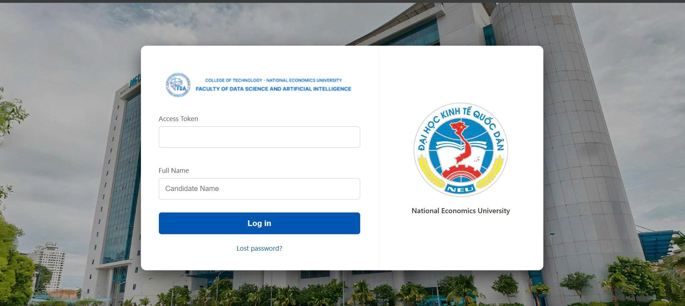

# WEB INTERVIEW RECORDER PROJECT
A web-based video interview platform that records candidate answers per question and uploads them incrementally to a Node.js server. Designed for a Computer Networks project.



## 📋 Table of Contents
- [Features](#features)
- [Architecture & Flow](#architecture--flow)
- [Prerequisites](#prerequisites)
- [Installation & Setup](#installation--setup)
- [API Contract](#api-contract)
- [File Storage & Naming](#file-storage--naming)
- [Speech-to-Text (Bonus)](#speech-to-text-bonus)

## Features
1.  **Sequential Recording:** Candidates answer up to 5 questions one by one.
2.  **Per-Question Upload:** Videos are uploaded immediately after hitting "Next" to prevent data loss.
3.  **Reliability:** Implements incremental uploads; if a network error occurs, the user cannot proceed until the upload succeeds.
4.  **Discord Integration:** Automatically logs finished sessions and uploads videos to a Discord channel via Webhook.
5.  **Metadata Tracking:** Generates a JSON log and Transcript file for every session.

## Architecture & Flow
**Client (Browser):**
- Captures video using `MediaDevices.getUserMedia`. *(Requires HTTPS to function)*
- Sends `multipart/form-data` requests via Fetch API.
- Handles retries on upload failure.

**Server (Node.js/Express):**
- Validates Tokens.
- Manages storage using `multer`.
- Stores files in time-stamped folders (Timezone: Asia/Bangkok).
- Simulates admin notification via Email logs and Discord Webhooks.

## Prerequisites
- **Node.js** (v18.0.0 or higher required for native `fetch` and `Blob` support).
- **HTTPS:** Required for Camera/Mic access if deploying publicly (not required for `localhost`).

## Installation & Setup

1.  **Clone the repository**
    ```bash
    git clone <your-repo-url>
    cd video-recorder
    ```

2.  **Install Dependencies**
    ```bash
    npm install
    ```

3.  **Configuration**
    * Open `server.js`.
    * (Optional) Update `WEBHOOK_URL` with your own Discord Webhook.
    * Ensure the `uploads` folder exists or allow the server to create it.

4.  **Run the Server**
    ```bash
    npm start
    ```
    * Server runs at: `https://localhost:3000`

## API Contract

### 1. Verify Token
* **Endpoint:** `POST /api/verify-token`
* **Body:** `{ "token": "36" }`
* **Response:** `{ "ok": true }`

### 2. Start Session
* **Endpoint:** `POST /api/session/start`
* **Body:** `{ "token": "...", "userName": "David Beckham" }`
* **Response:** `{ "ok": true, "folder": "9_12_2025_15_30_david_beckham" }`
* **Action:** Creates the directory on the server.

### 3. Upload Question
* **Endpoint:** `POST /api/upload-one`
* **Type:** `multipart/form-data`
* **Fields:**
    1.  `token` (text)
    2.  `folder` (text) - received from start session
    3.  `questionIndex` (text) - e.g., "1"
    4.  `transcript` (text) - (Bonus) The text of the answer
    5.  `video` (file) - The .webm video file
* **Response:** `{ "ok": true }`

### 4. Finish Session
* **Endpoint:** `POST /api/session/finish`
* **Body:** `{ "folder": "...", "questionsCount": 5 }`
* **Response:** `{ "ok": true }`
* **Action:** Finalizes metadata and triggers Discord upload.

## File Storage & Naming
Files are stored locally in the `uploads/` directory.

**Folder Naming Convention:**
`DD_MM_YYYY_HH_mm_user_name`
*(Timezone: Asia/Bangkok (GMT+7))*  
*Example: 9_12_2025_15_30_david_beckham*

**File Structure:**
```text
uploads/
└── 9_12_2025_15_30_david_beckham/
    ├── meta.json          # Stores metadata: start/end timestamps, token, question status
    ├── transcript.txt     # Combined transcript of all answers (if Speech-to-Text is enabled)
    ├── Q1.webm            # Video for Question 1 — uploaded immediately after answering
    ├── Q2.webm            # Video for Question 2 — independent upload
    ├── Q3.webm            # Video for Question 3
    ├── Q4.webm            # Video for Question 4
    ├── Q5.webm            # Video for Question 5
    └── ...                # Additional question videos if the session includes more questions
```

## Speech-to-text (Bonus):
If **Speech-to-Text (STT)** is enabled on the client side, each recorded answer is transcribed immediately after recording.
The transcript is then uploaded together with the corresponding video file.

### **How It Works:**

1. User records the answer to a question.
2. Before uploading, the browser runs STT (e.g., Web Speech API or a custom model).
3. The transcript text is appended to transcript.txt.
4. The same transcript is also sent to /api/upload-one for server-side logging.
